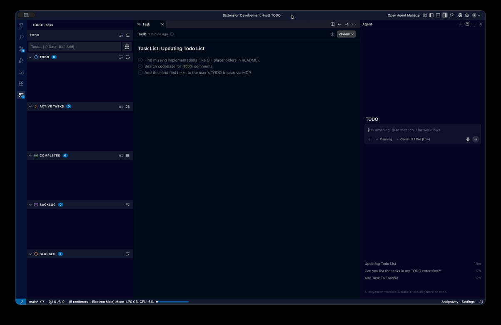

# TODO & MCP Task Tracker

A powerful, AI-ready task management extension for Visual Studio Code. Keep your workflow focused without leaving the editor. Features an integrated Context Protocol (MCP) server, Git-aware heuristics, drag-and-drop categorization.

## Features

### AI Agent & MCP Integration
The extension natively runs a Model Context Protocol (MCP) server that exposes your tasks to LLM agents (like **Cursor**, **Antigravity**, or **VSCode**).
* Agents can seamlessly read your current tasks, parse unstructured conversations or code commits, and bulk-add/update tasks autonomously.
* **Cursor Integration:** Automatically registers natively with Antigravity / Cursor / VSCode MCP Extension API using SSE. No manual `mcp.json` editing is required—start editing and your AI is immediately aware of your TODO list.

### Categorized Workflow
Organize your tasks into structured environments. Move tasks easily via Drag and Drop or keyboard shortcuts:
* **TODO**: Upcoming work.
* **Active**: What you are doing *right now*.
* **Blocked**: Tasks awaiting external resolution.
* **Completed**: Finished tasks.
* **Backlog**: The parking lot for later ideas.

### Git Heuristic Tracking
Stay in flow. The extension automatically monitors your Git activity. If it detects a commit message matching an active task title, it will automatically mark the task as **Completed**. If your Git commit or output mentions failures, it logs tasks as **Blocked**.

* **Urgency Badges**: Tasks color-code and push notification badges to the activity bar when overdue or due soon.

---

## Shortcuts & Interactions

Maximize your productivity with these built-in shortcuts inside the Webview Task Input:

| Command | Action |
| ------------- |:-------------:|
| `Enter` (Text Input) | Opens the Date Picker fields |
| `Ctrl + Enter` (Windows/Linux)   `Cmd + Enter` (Mac) | **Quick Add Task** immediately (bypasses date) |
| `Tab` / `Shift+Tab` / `Arrows` | Navigate smoothly between Day/Month/Year fields |
| `Escape` | Cancel Date Picker, return focus to text input |
| `Enter` (Empty Date Fields) | Add task without a due date |
| `Enter` (Filled Date Fields) | Validate and Add task |

### Action Buttons
- **Clean View**: Toggles hiding empty categories to save screen real estate.
- **Delete All / Clear Category**: Instantly purge completed or stale tasks.
- **Activate All**: Bring all TODOs into the Active swimlane.

---

## Commands

This extension provides the following commands via the VS Code Command Palette (`Cmd+Shift+P`):

* `TODO: Add Task` (`todo.addTask`): Quick input box to add a task globally.
* `TODO: Clear Completed` (`todo.clearCompleted`): Deletes all finalized tasks.
* `TODO: Clear Active` (`todo.clearActive`): Deletes all active tasks.

## Known Issues
-  Initial Release

## Release Notes
See [CHANGELOG.md](CHANGELOG.md) for detailed release history.
