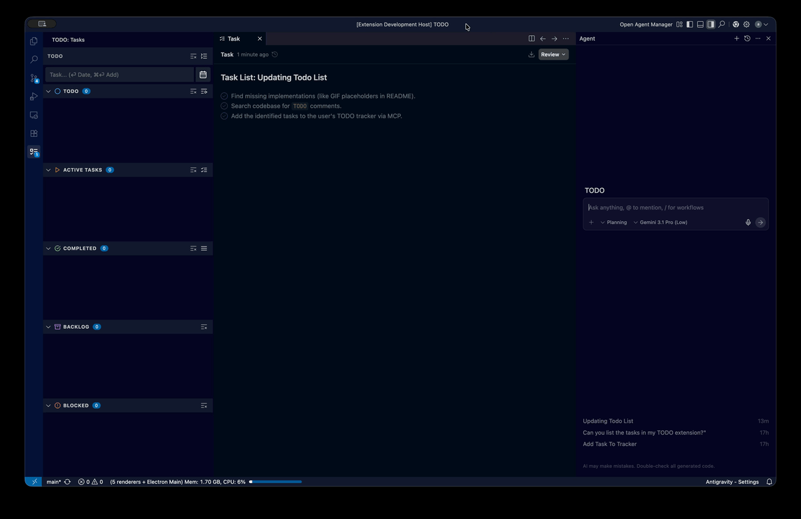

# TODO & MCP Task Tracker

A powerful, AI-ready task management extension for **Visual Studio Code and compatible editors** (including **Cursor**, **Antigravity**, and other VS Code forks). Keep your development workflow focused without leaving your editor. Features an integrated **Model Context Protocol (MCP)** server, Git-aware heuristics, interactive swimlane categorization, and automated agent rule deployment.

---

## Key Features

### 🤖 AI Agent & MCP Integration (Dual-Transport)
The extension natively runs a Model Context Protocol (MCP) server that exposes your tasks to autonomous LLM coding agents across any editor or environment:
* **Zero-Configuration Stdio Server** (`bin/todo-mcp.js`): Runs on-demand without open ports or background daemons. Ideal for CLI subagents, terminal scripts, and editor restarts.
* **Streamable HTTP/SSE Server**: Dynamic port allocation with multi-session management and auto-pruning for active editor windows.
* **Auto-Discovery & Rule Deployment**: Automatically generates and registers configs on workspace launch:
  * **In-Workspace Skills**: `.agents/skills/todo-tracker/SKILL.md` (for Antigravity and Gemini CLI)
  * **Cursor Rules**: `.cursor/rules/todo.mdc`
  * **Agent Guidelines**: `AGENTS.md` and `CLAUDE.md`
  * **MCP Configurations**: Auto-registered into `.cursor/mcp.json`, `.vscode/mcp.json`, `.gemini/mcp_config.json`, and OS-level client configs.

#### Available MCP Tools
| Tool | Description |
| --- | --- |
| `todo_get_tasks` | Retrieves all tasks with IDs, categories, due dates, and visual badges (🔵 TODO, 🟠 Active, 🟣 Backlog, 🔴 Blocked, 🟢 Completed). Supports optional category filtering. |
| `todo_add_tasks` | Bulk-adds structured tasks with optional due dates and categories. |
| `todo_update_tasks` | Bulk-updates task titles, categories, or due dates using exact task IDs. |
| `todo_delete_tasks` | Bulk-deletes specific tasks by their exact IDs. |
| `todo_clear_category` | Purges all tasks in a category (or all tasks) with a built-in safety confirmation preview step (`confirm: true/false`). |
| `todo_move_category` | Bulk-migrates tasks from one swimlane to another (e.g. Backlog $\rightarrow$ Active). |

---

### 📋 Categorized Swimlane Workflow
Organize your tasks into structured environments. Move tasks easily via Drag and Drop or keyboard shortcuts:
* **🔵 TODO**: Upcoming work items and scheduled tasks.
* **🟠 Active**: What you are working on *right now*.
* **🟣 Backlog**: The parking lot for future ideas and long-term plans.
* **🔴 Blocked**: Tasks awaiting external resolution or dependencies.
* **🟢 Completed**: Finished tasks.

---

### 💾 Flexible Storage Scopes
Manage your tasks where they belong. The extension supports three storage modes, accessible via toggle buttons in the sidebar header:

* **File Mode (Default)**: Stores tasks in a `.todo` JSON file in your project's root directory.
  * **Project Isolation**: 100% reliable task separation when switching workspaces or repositories.
  * **Bidirectional Live Sync**: Debounced file watcher updates the UI when `.todo` is modified externally or via Stdio MCP.
  * **On-Demand**: The `.todo` file is only created once you add your first task.
  * **Version Control Ready**: Check your `.todo` into Git to share task context with your team and AI agents.
* **Global Mode**: Shares the same task list across all folders and editor windows. Ideal for general developer to-do lists.
* **Workspace Mode**: Uses the editor's internal `workspaceState` storage (tasks are scoped per folder without creating a visible file).

---

### 🌿 Git Heuristic Tracking
Stay in flow with automatic Git event tracking:
* **Auto-Completion**: Automatically marks active tasks as **Completed** when commit messages match the task title.
* **Failure Detection**: Logs tasks as **Blocked** if Git commits or test outputs report errors.
* **Urgency Badges**: Tasks dynamically color-code and display notification badges in the activity bar when overdue or due soon.

---

## ⌨️ Shortcuts & Interactions

Maximize your productivity with these built-in shortcuts inside the Webview Task Input:

| Shortcut | Action |
| --- | --- |
| `Enter` (in text input) | Opens the Date Picker fields |
| `Ctrl + Enter` (Win/Linux)   `Cmd + Enter` (macOS) | **Quick Add Task** immediately (bypasses date) |
| `Tab` / `Shift + Tab` / `Arrow Keys` | Navigate between Day / Month / Year fields |
| `Escape` | Cancel Date Picker and return focus to text input |
| `Enter` (empty date fields) | Add task without a due date |
| `Enter` (filled date fields) | Validate date and add task |

### Sidebar Action Buttons
- **Global / File Toggles**: Instantly switch between shared and project-specific storage. The active mode is highlighted with a themed glow.
- **Clean View**: Toggles hiding empty categories to save screen real estate.
- **Delete All / Clear Category**: Instantly purge completed or stale tasks.
- **Activate All**: Bring all TODOs into the Active swimlane.

---

## 🛠️ Commands & Diagnostics

Access these commands from the Command Palette (`Cmd+Shift+P` on macOS, `Ctrl+Shift+P` on Windows/Linux):

| Command | Identifier | Description |
| --- | --- | --- |
| `TODO: Add Task` | `todo.addTask` | Quick input box to add a task globally. |
| `TODO: Clear Completed` | `todo.clearCompleted` | Deletes all completed tasks. |
| `TODO: Clear Active Tasks` | `todo.clearActive` | Deletes all currently active tasks. |
| `TODO: Add blocked task from selection` | `todo.addBlockedTaskFromSelection` | Creates a blocked task referencing selected code. |
| `TODO: Show MCP Logs` | `todo.showMcpLogs` | Opens the dedicated `TODO MCP` output channel. |
| `TODO: Verify MCP Setup & Tool Discovery` | `todo.verifyMcpSetup` | Audits MCP servers, rules, and port statuses. |
| `TODO: Copy MCP Configuration` | `todo.copyMcpConfig` | Copies Stdio or HTTP JSON configuration to clipboard. |
| `TODO: Setup AI Agent Rules` | `todo.setupAgentRules` | Scaffolds `.agents`, `.cursor/rules`, `AGENTS.md`, and `CLAUDE.md`. |
| `TODO: Debug MCP Server` | `todo.debugMcp` | Displays runtime server URI and active port status. |

---

## 📖 Release Notes
See [CHANGELOG.md](CHANGELOG.md) for detailed release history.
